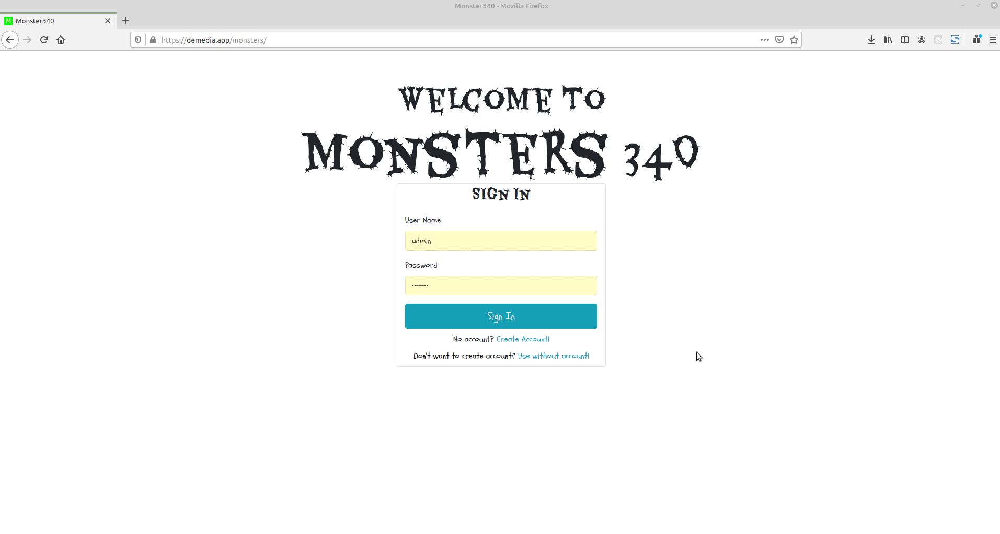

Monsters Project
================

About
-----
Chrisopher Elliott and I built this app together as a project for CS340 at Oregon State University, the databases course. The project guideline was to build a simple CRUD app with a relational database on the backend, but we wanted to do something a little more involved (and fun) to further our programming skills in general.

This project is built on the back-end with a NodeJS server and MariaDB for the database, and on the front-end with JavaScript, CSS, and HTML on the frontend.

Try it out!
-----------
The app is currently hosted at [demedia.app/monsters](https://demedia.app/monsters). Make an account and we'll keep track of your creations.

Preview
-------

